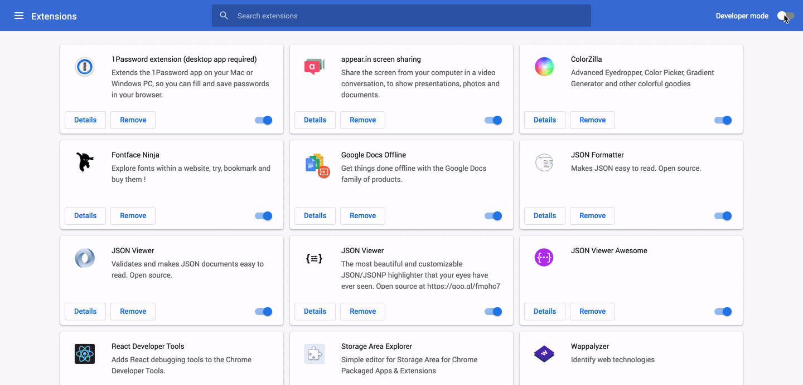
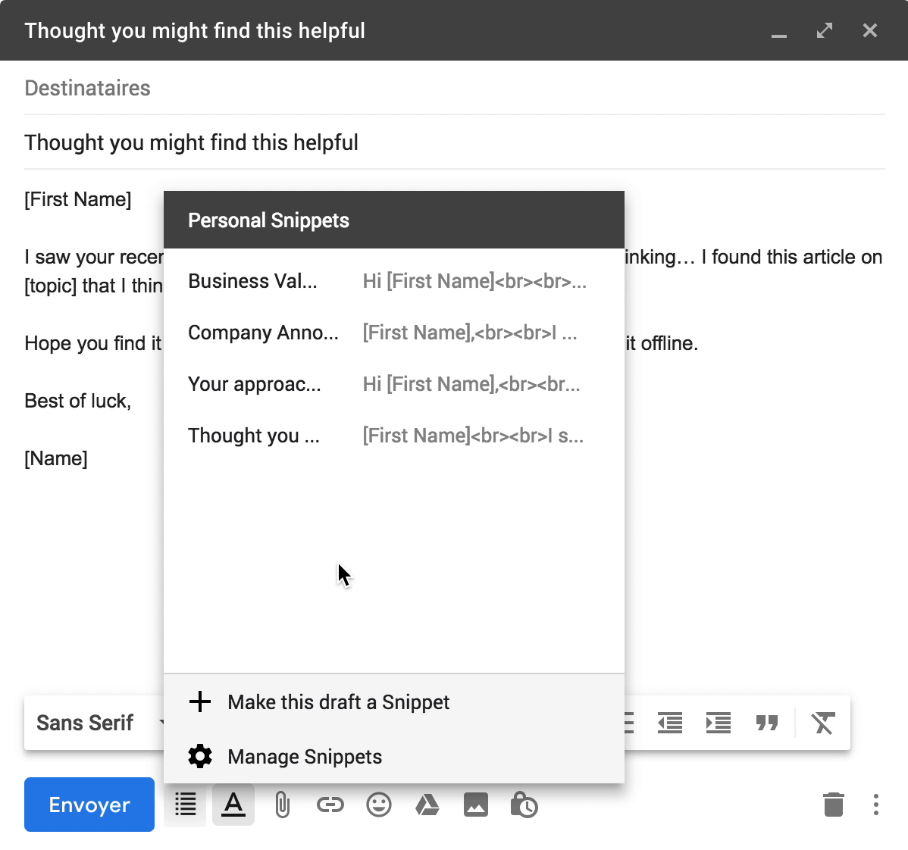
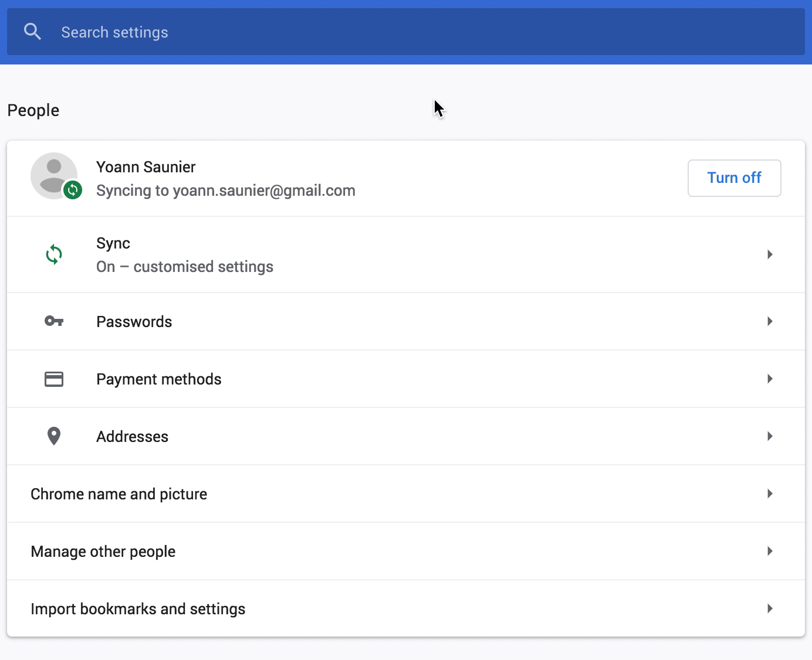

# Gmail Snippets - Chrome Extension

To build the extension, after having cloned the project, run:

```bash
yarn install
yarn build
```

The extension will be available under the `./build` directory.

## Installing the extension (Developer)



## Using the extension

Creating a snippet:


Choosing a snippet:


Deleting a snippet:



## Syncing your snippets (optional)


